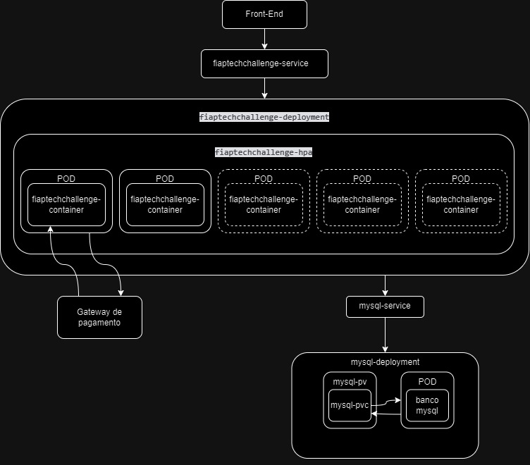

# Fiap tech challenge
Link do miro https://miro.com/app/board/uXjVKRWbQW0=/?share_link_id=57096918249
Este projeto consiste em uma api REST para o fluxo de restaurante solicitado no tech challenge FIAP.

## ✔️ Tecnologias e bibliotecas usadas
- `Java 21`
- `Spring Boot`
- `Lombok`
- `MySQL` 
- `Docker`
- `Kubernets`
-  `API MercadoPago` (https://www.mercadopago.com.br/developers/pt/reference/preferences/_checkout_preferences/post)

# Descrição do problema
Há uma lanchonete de bairro que está expandindo devido ao seu grande sucesso. Contudo, com a expansão e sem um sistema de controle de pedidos, o atendimento aos clientes pode se tornar caótico e confuso. Por exemplo, imagine que um cliente faça um pedido complexo, como um hambúrguer personalizado com ingredientes específicos, acompanhado de batatas fritas e uma bebida. O atendente pode anotar o pedido em um papel e entregá-lo à cozinha, mas não há garantia de que o pedido será preparado corretamente.

Sem um sistema de controle de pedidos, pode haver confusão entre os atendentes e a cozinha, resultando em atrasos na preparação e entrega dos pedidos. Os pedidos podem ser perdidos, mal interpretados ou esquecidos, levando à insatisfação dos clientes e à perda de negócios.

Em resumo, um sistema de controle de pedidos é essencial para garantir que a lanchonete possa atender os clientes de maneira eficiente, gerenciando seus pedidos e estoques de forma adequada. Sem ele, expandir a lanchonete pode acabar não dando certo, resultando em clientes insatisfeitos e impactando os negócios de forma negativa.

Para solucionar o problema, a lanchonete irá investir em um sistema de autoatendimento de fast food, que é composto por uma série de dispositivos e interfaces que permitem aos clientes selecionar e fazer pedidos sem precisar interagir com um atendente.

# Fluxos do projeto

## Executando localmente
Ao clonar o projeto, é possivel executar o docker com `docker compose up --build`, isso gerar uma instancia do banco e da aplicação. O banco esta na porta 5432 e a aplicação na 8080, então certifiquesse que as portas estejam livres.
Para acessar o swager do projeto acesse a URL http://localhost:8080/swagger-ui/index.html.

## Kubernets
Foi decidido utilizar Kubernets locamente com o Docker Desktop, segue a imagem da arquitetura definida:

Para o banco foi decidido utilizar o mysql, para criarmos ele primeiro definimos o Persistent Volume(PV) pelo arquivo mysql-pv.yaml com 10Gb de espaço, para subirmos ele utilizamos o comando:

`kubectl apply -f mysql-pv.yaml`

Após sua criação, definimos o Persistence Volume Claim(PVC), definimos com o tamanho maximo do PV de 10Gb, e criamos ele pelo comando:

`kubectl apply -f mysql-pvc.yaml`

Depois criamos o deployment com as configurações do banco mysql, definimos as informações de acesso ao banco e a porta para acesso, para executar usamos:

`kubectl apply -f mysql-deployment.yaml`

E por ultimo definimos o serviço para controlar o acesso com:

`kubectl apply -f mysql-service.yaml`

Com as configurações do banco feito, agora podemos criar o deployment da aplicação, onde definimos os segredos do banco, inicial de 2 replicas da aplicação, com recursos definidos, também criamos o container apontado para a imagem que subi no docker referenciada na ulysses903/fiaptechchallenge e no mesmo arquivo ja definimos o service. Ao executar o comando abaixo criaremos tanto o deployment quanto o service da aplicação:

`kubectl apply -f deployment.yaml`

Também definimos o Horizontal Pod Autoscaler(HPA) pelo arquivo hpa.yaml, nele temos um minimo de 2 pods como padrão e um maximo de 5, o hpa cuidara de auto escalar horizontalmente a aplicação quando todos os pods ativos chegarem a 50% dos recursos definidos no deployment, para executa-lo também temos:

`kubectl apply -f hpa.yaml`

Caso queira fazer um test de estresse pode ser executado o arquivo shell `stress_test.sh`.
## Fluxo para implementação da chamada das apis
O fluxo da lanchonete se inicia na tela de cadastro do cliente, ele informa o CPF ou decide continuar sem se identificar.
Caso ele informar o cpf o sistema ira consulta se o usuario já existe pelo endpoint `GET .../clientes/cpf`, se o cpf não existir ele terá que informar o nome e email para se cadastrar pelo endpoint `POST .../clientes`.
Caso o cadastro seja um sucesso, o cadastro seja um sucesso ou ele não se identifique o usuário será redicionado para a tela de seleção de combos, os produtos são buscados de acordo com cada tela:
- Para selcionar o lanche consulte o endpoint `GET .../lanches`
- Para selcionar o acompanhamento consulte o endpoint `GET .../acompanhamentos`
- Para selcionar o bebida consulte o endpoint `GET .../bebidas`
- Para selcionar o sobremesa consulte o endpoint `GET .../sobremesas`
  
Para finalizar o pedido e gerar o link de pagamento deve ser chamado o endpoint `POST .../pedidos`, será retornado um objeto com link de pagamento, id do pagamento do mercado pago e o id do pedido, com isso será redirecionado para o link de pagamento do mercado pago.
Ao acessar o link de pagamento você terá diversas opções para realizar o pagamento, ela possuíra a opção de pagar com QR Code, para pagar com QR Code você pode logar com o celular na conta teste com saldo para realizar o pagamento
- Conta com dinheriro: TESTUSER576019611/FP20xNG7f4
- Conta sem dinheiro: TESTUSER1657611808/eSPnfrpujr

No caso de sucesso de pagamento o link de pagamento redirecionará para o endpoint `PUT .../pedidos/{id}/confirmarPagamento` caso contrário `DELETE .../pedidos/{id}/cancelar`.
Então, no sucesso de pagamento o pedido irá ter seu status alterado para RECEBIDO pelo endpoint que confirmou o pagamento, caso contrário será deletado.
Caso de erro e o link de pagamento não redirecione automaticamente faça esse passo manualmente para testes.

Para listar todos pedidos temos o endpoint `GET .../pedidos`

Para a cozinha e os atendentes atualizarem o status do pedido temos os endpoints
- `PUT .../pedidos/{id}/atualizarPedidoParaEmPreparacao`
- `PUT .../pedidos/{id}/atualizarPedidoParaPronto`
- `PUT .../pedidos/{id}/atualizarPedidoParaFinalizado`

Para o CRUD de lanche temos
- `GET .../produtos/lanches`
- `GET .../produtos/lanches/{id}`
- `POST .../produtos/lanches`
- `PUT .../produtos/lanches/{id}`
- `DELETE .../produtos/lanches/{id}`

Para o CRUD de acompanhamentos temos
- `GET .../produtos/acompanhamentos`
- `GET .../produtos/acompanhamentos/{id}`
- `POST .../produtos/acompanhamentos`
- `PUT .../produtos/acompanhamentos/{id}`
- `DELETE .../produtos/acompanhamentos/{id}`

Para o CRUD de bebidas temos
- `GET .../produtos/bebidas`
- `GET .../produtos/bebidas/{id}`
- `POST .../produtos/bebidas`
- `PUT .../produtos/bebidas/{id}`
- `DELETE .../produtos/bebidas/{id}`

Para o CRUD de sobremesas temos
- `GET .../produtos/sobremesas`
- `GET .../produtos/sobremesas/{id}`
- `POST .../produtos/sobremesas`
- `PUT .../produtos/sobremesas/{id}`
- `DELETE .../produtos/sobremesas/{id}`

Para consultar todos os clientes temos 
- `GET .../clientes`
